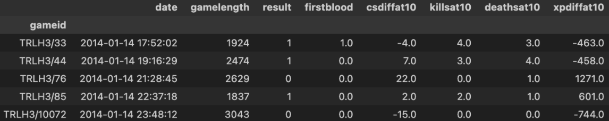

# Leagues of Legend Win Rate Analysis

by Raymond Wang, Huize Mao

---

## Introduction
League of Legends (LoL, or the League) is a multiplayer online battle arena (MOBA) game. In this project, we delve into a dataset derived from competitive League of Legends matches from 2014 to 2023, exploring factors that might influence the win rate of teams. Throughout our research, we aim to answer the question "What are some key factors that influence the outcome of the game?" Because of this question, we will explore various features (e.g., heroes killed, Creep Score (CS), economy, etc.) outlined below, both in a holistic view (i.e., the entire duration of the game) and in a partial view (i.e., the first ten minutes of the game). By answering our question, this project is particularly interesting for League fans who would like to understand the win rate of their favorite or supporting teams using the stats available from a game.

From the raw data, there are around 70,000 games, and for each game, there are 12 rows, 10 for each of the players from different positions (e.g., jungle, mage, top, etc.), and 2 for the result of each side. There are 131 columns in the dataset, including the winning side or the dragon type from the game. Relevant columns are described below.

### Descriptions of Key Columns
- `date`: Represents the date on which the game was played, following a format like 'YYYY-MM-DD'.
- `gamelength`: Indicates the duration of the game measured in seconds.
- `result`: Represents the outcome of the game for the team. `1` if the team won and `0` if the team lost.
- `firstblood`: Indicates whether the team achieved the first kill of the game. `1.0` if the team did and `0.0` if the team did not.
- `csdiffat10`: Stands for the difference in creep score (CS) between the team and the Red team by the 10-minute mark of the game. A positive `csdiffat10` means the team has a higher creep score than the Red team.
- `killsat10`: Represents the number of kills the team achieved by the 10-minute mark of the game.
- `deathsat10`: Indicates the number of times members of the team were killed by the 10-minute mark of the game.
- `xpdiffat10`: Represents the difference in experience points (XP) between the team and the Red team at 10 minutes into the game.
- `totalgold`: Represents the total amount of gold earned by the team throughout the game.
- `damagetochampions`: Indicates the total amount of damage dealt to enemy champions by the team.
- `wardskilled`: Represents the number of vision wards (or simply "wards") destroyed by the team.

Each of these features plays a crucial role in analyzing and understanding the dynamics and outcomes of League of Legends games.

---

## Cleaning and EDA
### Data Cleaning
When cleaning data, we choose to clean the data in two separate ways: one where we analyze the game as a whole (data cleaning 1) and one where we focus on the early game (data cleaning 2). 

### Data Cleaning 1
The result of the first data cleaning gives a holistic view of the entire game (whole duration). In the first data-cleaning process, we prepared different metrics for analysis. We selected relevant columns, including game ID, date, side, position, game length, result, total gold, damage to champions, wards killed, and team kills. We filtered the data to retain only team-level information by ensuring the 'position' column value was 'team.' We converted the 'date' column to a DateTime format for better time-based analyses. We then set the game ID as the index of the DataFrame to facilitate easier data manipulation in subsequent analysis. This cleaned dataset is now ready for exploratory data analysis, where we will investigate the relationships between various game metrics, such as total gold, damage dealt to champions, ward control, and team kills, and their impact on the game's outcome. 
The top few rows are displayed below:


### Data Cleaning 2
The result of the second data cleaning gives a partial view of the game (first ten minutes), and this will help us understand how early game advantages or disadvantages lead to the final result. The second dataset has fewer columns: we dropped unnecessary columns and set the game ID as the index for easier manipulation. The second data cleaning process involved selecting relevant columns such as game ID, date, side, position, game length, result, first blood, experience points at 10 minutes (xpat10), CS difference at 10 minutes, kills at 10 minutes, and deaths at 10 minutes. We filtered the data to include only team-level information and games with a positive length. Additionally, we calculated the experience point difference at 10 minutes (xpdiffat10) between the Blue and Red teams by grouping the data by game ID and subtracting the Red team's experience points from the Blue team's. Then we dropped all the red side information as it is a mirrored version of the blue side. In the exploratory data analysis phase, we aimed to uncover patterns and insights from the cleaned dataset, such as the impact of first blood on game results, the relationship between experience point differences and game outcomes, and the correlation between early-game metrics like kills, deaths, and CS difference at 10 minutes with the overall game result. 
The top few rows are displayed below:



### Univariate Analysis

This histogram plot shows the frequency of total gold each team makes in all games. The plot has a peak around 51000 and has a longer tail on the right so it’s right-skewed, meaning in some games a team makes significantly more gold than the others possibly indicating their dominance in the game.

### Bivariate Analysis 1

This is a two-dimensional box plot that shows the distribution of total kills by teams in all games when they lose versus when they win. When teams win, they tend to have higher median, lower, and upper quartile as well as higher upper range in number of kills. 

### Bivariate Analysis 2

Each data point in the graph shows the average win rate of a group of games with similar CS difference scores after 10 minutes. This plot indicates a positive correlation between the difference in CS after 10 minutes and the win rate.

### Interesting Aggregates

The table above pivots "team side" (i.e., red, blue) with "winning results," and aggregates the average stats for "Damage to Heroes", "Team Kill", "Total Gold", and "Wards Killed." The table indicates that winning teams have higher average stats, regardless of the sides they were in. It also indicates that if teams lose, they tend to have better stats when they are on the blue side. In contrast, when teams win, they tend to have better stats on the red side. In general, if a team is on the blue's side, there's less of a discrepancy between their stats between losing and winning, and if a team is on the red's side, there's more of a discrepancy in stats between winning and losing. This indicates that red is a more creative and unstable side to play on, and blue is a more stable and reserved side to play on.

---

## Assessment of Missingness

Here's what a Markdown table looks like. Note that the code for this table was generated _automatically_ from a DataFrame, using

```py
print(counts[['Quarter', 'Count']].head().to_markdown(index=False))
```

| Quarter     |   Count |
|:------------|--------:|
| Fall 2020   |       3 |
| Winter 2021 |       2 |
| Spring 2021 |       6 |
| Summer 2021 |       4 |
| Fall 2021   |      55 |

---

## Hypothesis Testing

---

## Prediction Problem

---

## Baseline Model

---

## Final Model

---

## Fairness Analysis


---