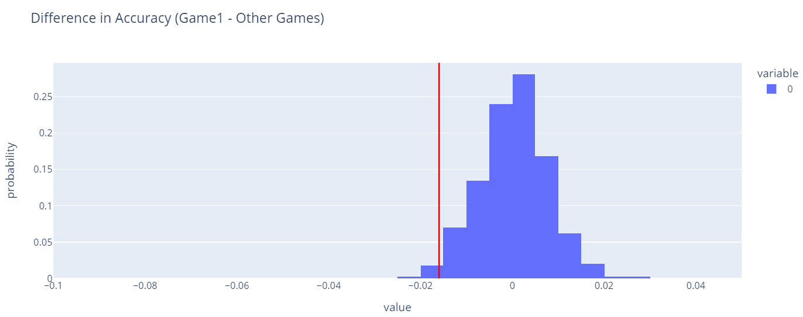

# Leagues of Legend Win Rate Analysis

by Raymond Wang, Huize Mao

---

## Introduction
League of Legends (LoL, or the League) is a multiplayer online battle arena (MOBA) game. In this project, we delve into a dataset derived from competitive League of Legends matches from 2014 to 2023, exploring factors that might influence the win rate of teams. Throughout our research, we aim to answer the question "What are some key factors that influence the outcome of the game?" Because of this question, we will explore various features (e.g., heroes killed, Creep Score (CS), economy, etc.) outlined below, both in a holistic view (i.e., the entire duration of the game) and in a partial view (i.e., the first ten minutes of the game). By answering our question, this project is particularly interesting for League fans who would like to understand the win rate of their favorite or supporting teams using the stats available from a game.

From the raw data, there are around 70,000 games, and for each game, there are 12 rows, 10 for each of the players from different positions (e.g., jungle, mage, top, etc.), and 2 for the result of each side. There are 131 columns in the dataset, including the winning side or the dragon type from the game. Relevant columns are described below.

### Descriptions of Key Columns
- `date`: Represents the date on which the game was played, following a format like 'YYYY-MM-DD'.
- `gamelength`: Indicates the duration of the game measured in seconds.
- `result`: Represents the outcome of the game for the team. `1` if the team won and `0` if the team lost.
- `firstblood`: Indicates whether the team achieved the first kill of the game. `1.0` if the team did and `0.0` if the team did not.
- `csdiffat10`: Stands for the difference in creep score (CS) between the team and the Red team by the 10-minute mark of the game. A positive `csdiffat10` means the team has a higher creep score than the Red team.
- `killsat10`: Represents the number of kills the team achieved by the 10-minute mark of the game.
- `deathsat10`: Indicates the number of times members of the team were killed by the 10-minute mark of the game.
- `xpdiffat10`: Represents the difference in experience points (XP) between the team and the Red team at 10 minutes into the game.
- `totalgold`: Represents the total amount of gold earned by the team throughout the game.
- `damagetochampions`: Indicates the total amount of damage dealt to enemy champions by the team.
- `wardskilled`: Represents the number of vision wards (or simply "wards") destroyed by the team.
- `league`: Represents the league that the game took place, indicative of country or level.

Each of these features plays a crucial role in analyzing and understanding the dynamics and outcomes of League of Legends games.

---

## Cleaning and EDA

Note: The data is obtained on the website [Oracle’s Elixir](https://oracleselixir.com/tools/downloads) at the provided Google Drive link.

### Data Cleaning
When cleaning data, we choose to retain columns so we can capture two aspects to the game: one where we analyze the game as a whole (data cleaning 1) and one where we focus on the early game (data cleaning 2). 

Data Cleaning Aspect 1: The result of the data cleaning gives a holistic view of the entire game (whole duration) as well as information of the game at 10 minutes. In the data-cleaning process, we prepared different metrics for analysis. We selected relevant columns, including game ID, position, league, date, side, game length, result, firstblood, total gold, damage to champions, wards killed, and team kills. We filtered the data to retain only team-level information by ensuring the ‘position’ column value was ‘team.’ We converted the ‘date’ column to a DateTime format for better time-based analyses. We then set the game ID as the index of the DataFrame to facilitate easier data manipulation in subsequent analysis. Then we drop the ‘position’ column as it is not longer needed. This cleaned dataset is now ready for exploratory data analysis, where we will investigate the relationships between various game metrics, such as total gold, damage dealt to champions, ward control, and team kills, and their impact on the game’s outcome. 
The top few rows are displayed below:
Data Cleaning Aspect 2: The result of the second data cleaning gives a partial view of the game (first ten minutes), and this will help us understand how early game advantages or disadvantages lead to the final result. The second dataset has fewer columns: we dropped unnecessary columns and set the game ID as the index for easier manipulation. The second data cleaning process involved selecting relevant columns such as game ID, date, side, position, game length, result, first blood, experience points at 10 minutes (xpat10), CS difference at 10 minutes, kills at 10 minutes, and deaths at 10 minutes. We filtered the data to include only team-level information and games with a positive length. Additionally, we calculated the experience point difference at 10 minutes (xpdiffat10) between the Blue and Red teams by grouping the data by game ID and subtracting the Red team's experience points from the Blue team's. Then we dropped all the red side information as it is a mirrored version of the blue side. In the exploratory data analysis phase, we aimed to uncover patterns and insights from the cleaned dataset, such as the impact of first blood on game results, the relationship between experience point differences and game outcomes, and the correlation between early-game metrics like kills, deaths, and CS difference at 10 minutes with the overall game result. 

Combining the two aspects, we retain our dataset. The top few rows are displayed below:

### Univariate Analysis

This histogram plot shows the frequency of total gold each team makes in all games. The plot has a peak around 51000 and has a longer tail on the right so it’s right-skewed, meaning in some games a team makes significantly more gold than the others possibly indicating their dominance in the game.

### Bivariate Analysis 1

This is a two-dimensional box plot that shows the distribution of total kills by teams in all games when they lose versus when they win. When teams win, they tend to have greater "median, lower, and upper quartile" as well as greater "upper range" in number of kills. 

### Bivariate Analysis 2

Each data point in the graph shows the average win rate of a group of games with similar CS difference scores at 10 minutes. This plot indicates a positive correlation between the difference in CS at 10 minutes and the win rate.

### Interesting Aggregates

The table above pivots "team side" (i.e., red, blue) with "winning results," and aggregates the average stats for "Damage to Heroes", "Team Kill", "Total Gold", and "Wards Killed." The table indicates that winning teams have higher average stats, regardless of the sides they were in. It also indicates that if teams lose, they tend to have better stats when they are on the blue side. In contrast, when teams win, they tend to have better stats on the red side. In general, if a team is on the blue's side, there's less of a discrepancy between their stats between losing and winning, and if a team is on the red's side, there's more of a discrepancy in stats between winning and losing. This indicates that red is a more creative and unstable side to play on, and blue is a more stable and reserved side to play on.

---

## NMAR Analysis
In our dataset, we've identified that the missingness of data within the columns `Ban1`, `Ban2`, and `Ban3` appears to be Not Missing At Random (NMAR). These columns represent the champions banned by each side in a League of Legends match. In certain cases, teams may strategically choose not to ban a champion. This decision, intended to provide more flexibility and conceal strategic intentions, results in missing values in these ban columns.

The rationale for classifying this missingness as NMAR stems from the nature of the decision-making process behind champion bans. Unlike random omissions or missingness that correlates with observable variables, the absence of bans is a deliberate choice made by teams. This choice is not readily apparent or inferable from other data within the dataset, making it a clear case of NMAR. The dataset does not contain explicit indicators for intentional non-bans, nor can the reasoning for such decisions be deduced from other available columns.

## Assessment of Missingness
In this section we tested the dependcy of missingness in `csdiffat10` on `league` and `result`

### Investigating the Dependency of `csdiffat10` on `league`
We explored whether the missingness of data in the column `csdiffat10` depends on the `league` in which the match is played. Our hypothesis was that the collection of information, including the creep score difference at 10 minutes (`csdiffat10`), might vary by league, affecting the presence of this data.

### Distribution of Leagues with and without `csdiffat10` Data
Below is the distribution of leagues for matches with and without `csdiffat10` data:

| League | csdiffat10 is not missing | csdiffat10 is missing |
|--------|---------------------------|-----------------------|
| AL     | 0.002694                  | 0.000000              |
| AOL    | 0.000576                  | 0.000000              |
| BIG    | 0.005263                  | 0.000000              |
| BL     | 0.003021                  | 0.000000              |
| BM     | 0.003737                  | 0.000000              |
| BRCC   | 0.006571                  | 0.000000              |
| CBLOL  | 0.025427                  | 0.000000              |
| CBLOLA | 0.010666                  | 0.000000              |
| CDF    | 0.002118                  | 0.000000              |
| CISC   | 0.001650                  | 0.000000              |
| CK     | 0.021659                  | 0.000000              |
| CLS    | 0.009015                  | 0.000000              |
| CT     | 0.002382                  | 0.000000              |
| CU     | 0.003208                  | 0.000000              |
| DCup   | 0.002585                  | 0.049632              |
| DDH    | 0.012861                  | 0.000000              |
| DL     | 0.003052                  | 0.000000              |
| EBL    | 0.011616                  | 0.000000              |
| EGL    | 0.001433                  | 0.000000              |
| EL     | 0.002709                  | 0.000000              |
| EM     | 0.004204                  | 0.000000              |
| EPL    | 0.001339                  | 0.000000              |
| ESLOL  | 0.008377                  | 0.000000              |
| EU CS  | 0.007879                  | 0.000000              |
| EU LCS | 0.024197                  | 0.000000              |
| EUM    | 0.014605                  | 0.000000              |
| GL     | 0.004189                  | 0.000000              |
| GLL    | 0.015213                  | 0.000000              |
| GPL    | 0.002133                  | 0.000000              |
| GSG    | 0.000825                  | 0.000000              |
| HC     | 0.008657                  | 0.000000              |
| HM     | 0.011538                  | 0.000000              |
| HS     | 0.001230                  | 0.000000              |
| IC     | 0.002055                  | 0.000000              |
| IEM    | 0.002164                  | 0.000000              |
| IWCI   | 0.000607                  | 0.000000              |
| KeSPA  | 0.003830                  | 0.000000              |
| LAS    | 0.012348                  | 0.000000              |
| LCK    | 0.061224                  | 0.000125              |
| LCKC   | 0.014107                  | 0.000000              |
| LCL    | 0.013733                  | 0.000000              |
| LCO    | 0.008206                  | 0.000000              |
| LCS    | 0.022811                  | 0.000000              |
| LCSA   | 0.024898                  | 0.000125              |
| LDL    | 0.042290                  | 0.471131              |
| LEC    | 0.020195                  | 0.000249              |
| LFL    | 0.016380                  | 0.000000              |
| LFL2   | 0.007988                  | 0.000000              |
| LGL    | 0.000125                  | 0.000000              |
| LHE    | 0.015197                  | 0.000000              |
| LJL    | 0.022095                  | 0.000000              |
| LJLA   | 0.002569                  | 0.000000              |

### Statistical Analysis Results Using Total Variation Distance (TVD) as Test Statistic
- **Observed Statistic:** 0.9127832903634927
- **P-value:** 0.0

The p-value of 0 indicates a negligible likelihood that the observed difference in the distribution of leagues, between matches with and without `csdiffat10` data, could occur by chance. This suggests that the missingness of `csdiffat10` is indeed dependent on the league, supporting our hypothesis that different leagues may have distinct practices for data collection, leading to Missing at Random (MAR) characteristics for this variable.

### Analysis of Missingness Dependency on Game Result
We conducted an analysis to determine whether the missingness of the `csdiffat10` data is dependent on the game's outcome. Our goal was to ascertain if the absence of creep score difference data at the 10-minute mark (`csdiffat10`) was influenced by whether the blue team wins or loses the game.

### Observed Distribution of Game Outcomes with and without `csdiffat10` Data
The table below presents the observed distribution of game outcomes for matches with and without `csdiffat10` data:

| Outcome   | csdiffat10 is not missing | csdiffat10 is missing |
|-----------|---------------------------|-----------------------|
| Red Win   | 0.468648                  | 0.464148              |
| Blue Win  | 0.531352                  | 0.535852              |

### Statistical Analysis Results Using Total Variation Distance (TVD) as Test Statistic
- **Observed Statistic (TVD):** 0.004500654234423335
- **P-value:** 0.432

Using the Total Variation Distance (TVD) as our test statistic, we found an observed statistic of 0.0045, with a p-value of 0.432. This high p-value indicates a 43% probability that any observed differences in the distribution of game outcomes (win/loss) between matches with and without `csdiffat10` data could occur by chance.

### Conclusion and Interpretation

Given the p-value of 0.432, we conclude that the missingness of `csdiffat10` is not dependent on the game's result. This finding suggests that whether the team wins or loses does not influence the collection or reporting of the creep score difference at the 10-minute mark. The use of TVD as a test statistic provided a nuanced measure of the discrepancy in distributions between our groups of interest, supporting a robust analysis of missingness dependency.

### Section ("Missingness") Conclusion
This analysis supports that the presence of detailed match data about "the creep score difference at the 10-minute mark" (`csdiffat10`), is dependent on the league that the match takes place, and is not dependent on the game result on that match.

---

## Permutation Testing
### **Null and Alternative Hypotheses**

- **Null Hypothesis (H0):** "The distribution of `Creep Score at Ten Minutes` is the same between winning teams and losing teams."
- **Alternative Hypothesis (H1):** "The distribution of `Creep Score at Ten Minutes` is different between winning teams and losing teams."

### **Choice of Test Statistic and Significance Level**

- **Test Statistic:** We selected the **Kolmogorov-Smirnov (KS) test statistic** because it effectively compares the distributions between two samples. This choice is apt for our hypothesis, which concerns the distribution of CS differences between winning and losing teams.
- **Significance Level (α):** A threshold of **0.05** was chosen to determine statistical significance. This level is widely accepted for balancing Type I and Type II error rates in hypothesis testing.

### **Justification for Our Approach**

The KS test is an excellent choice for our analysis due to its non-parametric nature, allowing us to compare distributions without assuming a specific distribution shape. Moreover, employing a permutation test enhances the robustness of our findings. This method does not rely on assumptions about the distribution of the test statistic under the null hypothesis, thereby providing a strong foundation for our conclusion.

### **Visualization of Hypothesis Test**

*This histogram shows the distribution of KS statistics obtained from permuted samples alongside our observed statistic, marked in red. The extreme nature of our observed statistic compared to the permutations underscores the significant difference in creep score distributions between winning and losing teams.*

### **Results and Conclusion**

Upon conducting the test with **1,000 iterations** in our permutation loop, we observed a resulting **p-value of 0.0**. This exceptionally low p-value leads us to **reject the null hypothesis**. It indicates a statistically significant difference in the distribution of `Creep Score at Ten Minutes` between teams that win and those that lose. In the context of League of Legends, this suggests that the early game advantage, as measured by creep score differences at the ten-minute mark, could be a strong indicator of a team's likelihood of winning the match.

### **Interpreting the Conclusion**

Our analysis reveals a significant statistical difference in the distribution of `Creep Score at Ten Minutes` between teams that win and those that lose. This indicates that the early game creep score can have an impact on the game's outcome. However, it's important to note that the Kolmogorov-Smirnov test allows us to conclude that there is a difference in the distributions of these scores between winning and losing teams, but it does not specify the nature of the impact or suggest a direct cause-and-effect relationship. 

Therefore, while our results suggest that differences in early game creep score are associated with whether a team wins or loses, they do not imply that higher creep score directly causes a win. Players and teams may view the creep score as one of many indicators of early game success, which could contribute to winning strategies when combined with other factors.

---

## Prediction Problem
### **Problem Statement**

Our objective is to predict the winning outcome for a League of Legends team based on early-game performance metrics. This task falls under the domain of **binary classification** since each game outcome can only be one of two states: a win or a loss for the team in question.

### **Type of Problem**

- **Classification Type:** Binary Classification
- **Reason:** The outcome we aim to predict is binary, with the only two possible outcomes being "win" or "lose."

### **Response Variable**

- **Response Variable:** `result`
- **Rationale:** We chose `result` as the response variable because it directly represents the outcome of a game, making it the most straightforward indicator of success (win = 1, lose = 0) for a team based on their performance metrics.

### **Predictors**

The features we are using to predict the game outcome include:
- `firstblood`: Indicates whether the team achieved the first kill of the game.
- `csdiffat10`: The difference in creep score between the team and their opponents at the 10-minute mark.
- `killsat10`: The number of kills achieved by the team by the 10-minute mark.
- `deathsat10`: The number of times team members were killed by the 10-minute mark.
- `xpdiffat10`: The difference in experience points between the team and their opponents at 10 minutes.
- `date`: The time in which the match took place.

### **Evaluation Metric**

- **Chosen Metric:** F1-score
- **Reasoning:** The F1-score is chosen over accuracy because it provides a more balanced measure of a model's performance, especially in scenarios where the data might be imbalanced. The F1-score is the harmonic mean of precision and recall, making it an excellent metric for cases where both false positives and false negatives are crucial to the prediction problem. In competitive games like League of Legends, accurately predicting both wins and losses is equally important, and a model that only performs well in one area (e.g., predicting wins but not losses) may not be very useful. Therefore, the F1-score helps ensure our model is both precise and robust in its predictions.

By focusing on these early-game indicators and evaluating our model with the F1-score, we aim to build a predictive model that not only accurately identifies potential game outcomes but also minimizes the impact of class imbalance and prioritizes both precision and recall in its predictions. This is a reasonable model in the real-world because as fans watch the game, they typically will have access the game stats in the early game, and they could then use this model to help them understand the likelihood their team wins.

---

## Baseline Model

In our project, we aim to predict the outcome of League of Legends matches (win or lose) based on early game performance indicators. For this purpose, we employed a RandomForestClassifier from Scikit-learn. This choice was motivated by the RandomForest's robustness and its suitability for handling binary classification tasks effectively.

### Features Used in the Baseline Model

- `firstblood`: A nominal (boolean) feature indicating whether the team achieved the first kill of the game, represented as 1 (yes) or 0 (no).
- `csdiffat10`: A quantitative feature that represents the difference in creep score between the team and its opponent at the 10-minute mark of the game.

**Feature Types and Encoding:**
- **Quantitative Features:** 1 (`csdiffat10`). The `firstblood` feature, being boolean, was directly utilized in our RandomForestClassifier without the need for additional encoding. This binary representation perfectly suits nominal features in classification models.
- **Nominal (Boolean) Features:** 1 (`firstblood`) The `csdiffat10` feature was used as is, given its quantitative nature, allowing the RandomForest algorithm to interpret and leverage this continuous variable for prediction.

**Feature Types:**
- **Quantitative Features:** 1 (`csdiffat10`)
- **Ordinal Features:** 0
- **Nominal (Boolean) Features:** 1 (`firstblood`)

### Model Performance

The performance of our RandomForest model was rigorously evaluated using the F1-score to assess its precision and recall balance. The model achieved an **F1-score of 0.6868**. To provide a holistic view of the model's performance, we also considered its accuracy:

### Assessment of Model Quality

Given the F1-score of 0.6831, we consider our model to be okay for initial predictions but see room for improvement. The model's balance between precision and recall, as reflected in the F1-score, suggests it can reasonably predict match outcomes. However, enhancing model accuracy and the F1-score could yield more reliable predictions. 

The RandomForestClassifier's strength lies in its ability to handle the dataset's complexities, including the nominal boolean feature `firstblood` and the quantitative `csdiffat10`. However, improvements might be attained through feature engineering, hyperparameter tuning, or exploring alternative models.

---

## Final Model

For the final model, we've introduced and engineered several features aiming to capture the complexities of early-game dynamics:

### New Features Added in the Model
- **KDA at 10 Minutes (`kdaat10`):** We calculated a new feature representing the Kill-Death ratio at the 10-minute mark, which provides a comprehensive view of a player's early performance. This ratio is crucial as early game advantages often translate to higher chances of winning. The formula adjusts for zero deaths to avoid division by zero errors.
- **Polynomial Features:** We applied polynomial transformations to `csdiffat10` (Creep Score Difference at 10 Minutes) and `xpdiffat10` (Experience Point Difference at 10 Minutes). This allows our model to consider not only the linear impact of these differences but also their higher-order interactions, capturing the non-linear ways they might affect match outcomes.
- **Date Extraction (`year_month`):** Recognizing the evolving nature of game strategies and patches over time, we extracted the year and month from the match date. This temporal information helps our model understand performance in the context of specific game versions, which is vital as early-game strategies effectiveness can change significantly with each game update.

### Modeling Algorithm and Hyperparameters

Our choice of modeling algorithm is the **RandomForestClassifier**. This ensemble method is known for its robustness and ability to handle complex, non-linear relationships between features without extensive hyperparameter tuning. For our final model, the RandomForest performed best with the following hyperparameters:
- `n_estimators`: The number of trees in the forest. A higher number increases the model's ability to capture various aspects of the data but also increases computational cost.
- `max_depth`: Controls the depth of each tree. Deeper trees can capture more detailed information but risk overfitting.

- **Best Parameters Found:** 
  - `max_depth`: 10
  - `n_estimators`: 200

This configuration was determined after fitting **5 folds for each of 6 candidates, totaling 30 fits** during the grid search process.
The selection of hyperparameters was conducted through a grid search, balancing the trade-offs between model complexity and generalization ability. This systematic approach ensured that we identified a configuration that offers the best performance on our validation set.

- **Best F1-score from Grid Search:** 0.7180181001263564
- **F1-score on Test Data:** 0.7188892537173414

### Final Model Performance vs. Baseline Model
These F1-scores indicate a significant improvement in the model's ability to predict match outcomes accurately, striking a balance between precision and recall. This improvement over the baseline model is indicative of the effectiveness of our feature engineering efforts and hyperparameter tuning.

The introduction of engineered features and the optimization of RandomForest hyperparameters have led to a noticeable improvement in our model's predictive performance. Our final model achieved an **F1-score of 0.718**, a **3%** improvement from the baseline model. The metric chosen for its balance between precision and recall, particularly important in the context of our imbalanced dataset.

### Conclusion

Our enhanced model, through the incorporation of meaningful features and the strategic use of RandomForestClassifier, demonstrates a significant step forward in predicting the outcomes of League of Legends matches. By closely aligning our feature engineering with the nuances of the game's early dynamics and employing a robust classification algorithm, we've developed a predictive framework that offers insightful forecasts of match results, paving the way for deeper analyses and applications in strategic game planning.

---

## Fairness Analysis

### Overview: Model Performance Across Different Game Sets

In assessing the fairness of our predictive model, we focus on comparing its performance across different game sets. Specifically, we examine whether the model's performance on Game Set 1 is statistically equivalent to its performance on Game Sets 2, 3, 4, and 5 combined.

### Group Definition

- **Group X (Control Group):** Game Set 1, which constitutes 63% of our dataset.
- **Group Y (Treatment Groups):** The combined sets of Game Set 2, Game Set 3, Game Set 4, and Game Set 5, making up the remaining 37% of our dataset.

### Evaluation Metric

Our primary evaluation metric for model performance is the F1-score, chosen for its balance between precision and recall, which is critical in our binary classification task.

### Hypotheses

- **Null Hypothesis (H0):** The mean F1-score performance of the model on Game Set 1 is the same as its performance on Game Sets 2, 3, 4, and 5 combined.
- **Alternative Hypothesis (H1):** There is a significant difference in the mean F1-score performance of the model between Game Set 1 and the combined Game Sets 2, 3, 4, and 5.

### Test Statistic and Significance Level

- **Test Statistic:** The difference in mean F1-score performance between Group X and Group Y.
- **Significance Level (α):** 0.05, a standard threshold for determining statistical significance.

### Results and Conclusion

- **Resulting p-value:** 0.016
- Given the observed p-value of 0.016, we reject the null hypothesis. This suggests that there is a statistically significant difference in the model's performance between Game Set 1 and the combined Game Sets 2, 3, 4, and 5. This finding challenges the initial assumption of fairness in model performance across the different game sets.

### Visualization of Permutation Test

### Reflection

The fairness analysis, indicated by a p-value of 0.016, reveals statistically significant performance differences across game sets, with Game Set 1 showing distinct results from the other sets. This outcome underscores the importance of scrutinizing model fairness, especially given the disproportional distribution of data (63% in Game Set 1 vs. 37% in others). The significance of these findings motivates further investigation into potential biases or factors contributing to the observed disparities. Future work may explore more nuanced analyses within each game set, incorporate additional performance metrics, or apply other fairness definitions to deepen our understanding and ensure equitable model performance.

---